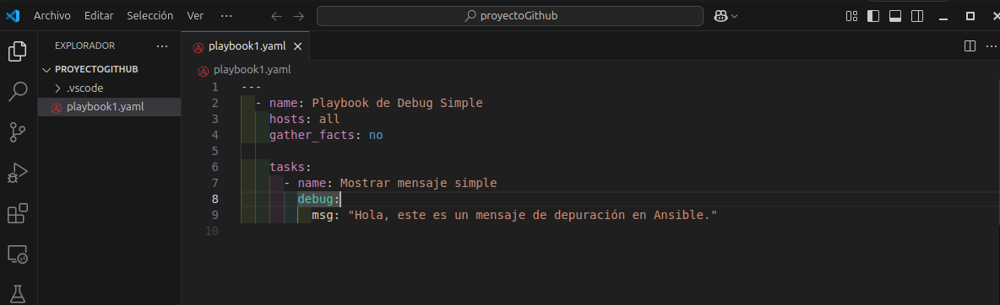
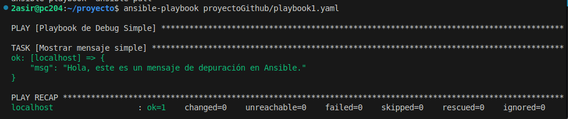
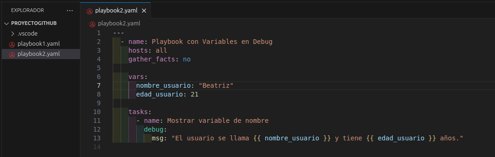
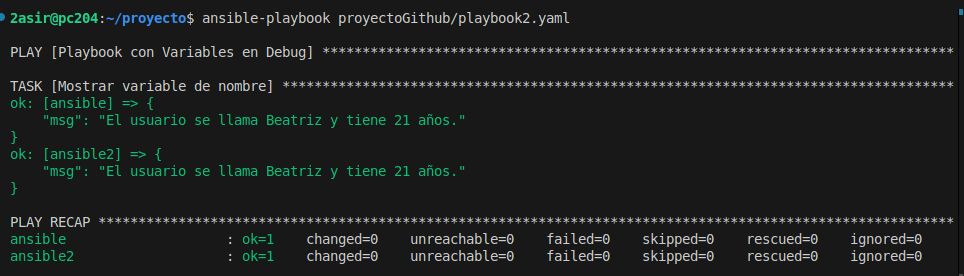
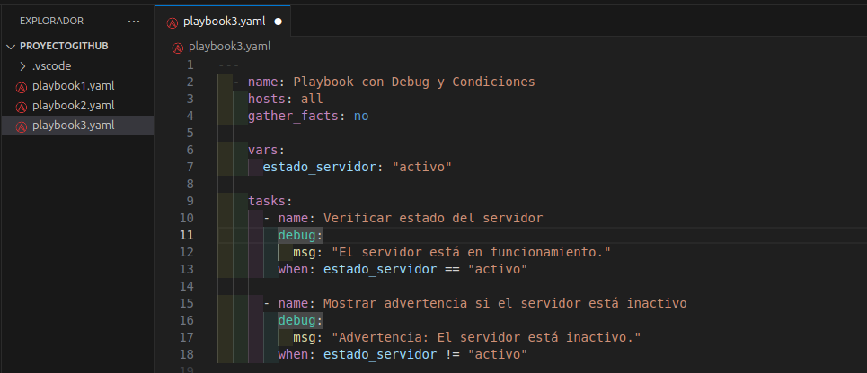
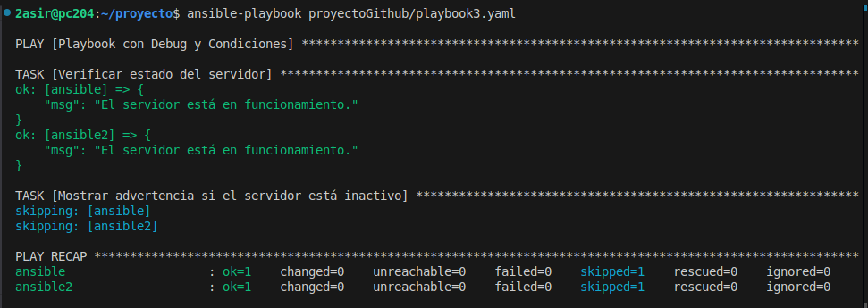

## Primer playbook
### Código:

```yml
---
  - name: Playbook de Debug Simple
    hosts: all
    gather_facts: no
  
    tasks:
      - name: Mostrar mensaje simple
        debug:
          msg: "Hola, este es un mensaje de depuración en Ansible."

```

- Se define un playbook con - name: Playbook de Debug Simple.

- Se usa hosts: all, lo que significa que se ejecutará en todas las máquinas.

- gather_facts: no evita la recolección de información del sistema (para hacerlo más rápido).

- Se define una tarea con el módulo debug que muestra un mensaje.





## Segundo playbook
### Código:

```yml
---
  - name: Playbook con Variables en Debug
    hosts: all
    gather_facts: no
  
    vars:
      nombre_usuario: "Beatriz"
      edad_usuario: 21
  
    tasks:
      - name: Mostrar variable de nombre
        debug:
          msg: "El usuario se llama {{ nombre_usuario }} y tiene {{ edad_usuario }} años."

```

- Podemos declarar las variables dentro del mismo código o crearlas en otro archivo y llamarlas dentro del código.

- Se definen variables (nombre_usuario y edad_usuario).
  
- Se usa debug para imprimir un mensaje utilizando las variables con {{ variable }}.





## Tercer playbook
### Código:

```yml
---
  - name: Playbook con Debug y Condiciones
    hosts: localhost
    gather_facts: no
  
    vars:
      estado_servidor: "activo"
  
    tasks:
      - name: Verificar estado del servidor
        debug:
          msg: "El servidor está en funcionamiento."
        when: estado_servidor == "activo"
  
      - name: Mostrar advertencia si el servidor está inactivo
        debug:
          msg: "Advertencia: El servidor está inactivo."
        when: estado_servidor != "activo"

```

- Se define la variable estado_servidor.
  
- Se usa when: para ejecutar tareas condicionalmente:
  
    - Si el servidor está "activo", se muestra un mensaje de que está funcionando.

    - Si no está "activo", se muestra una advertencia.







